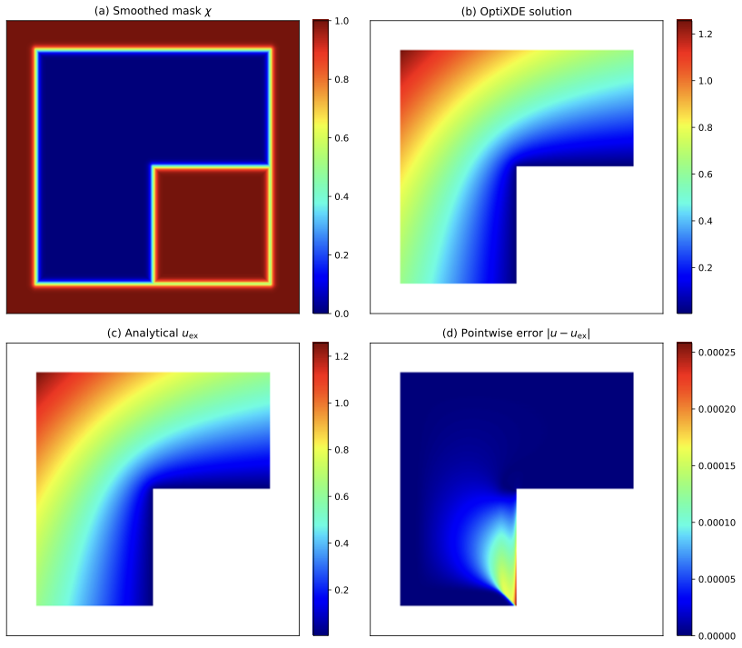
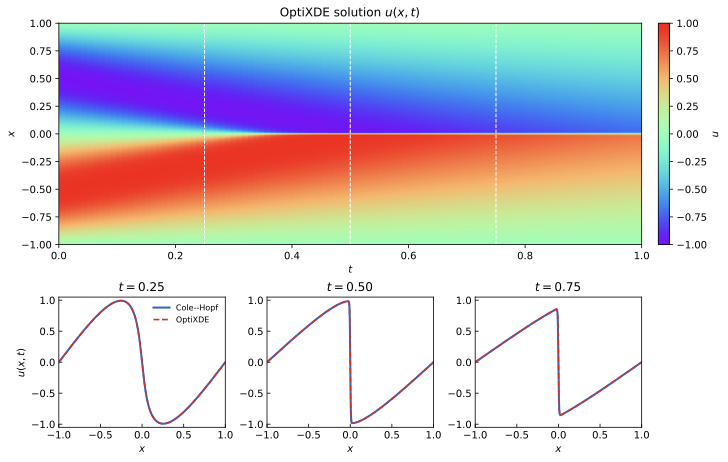
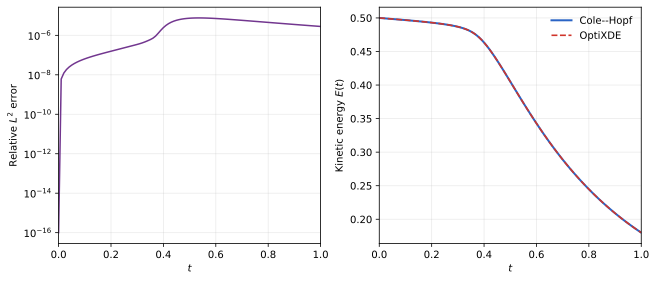
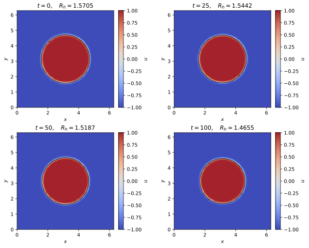
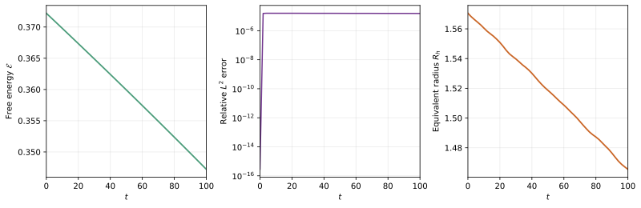
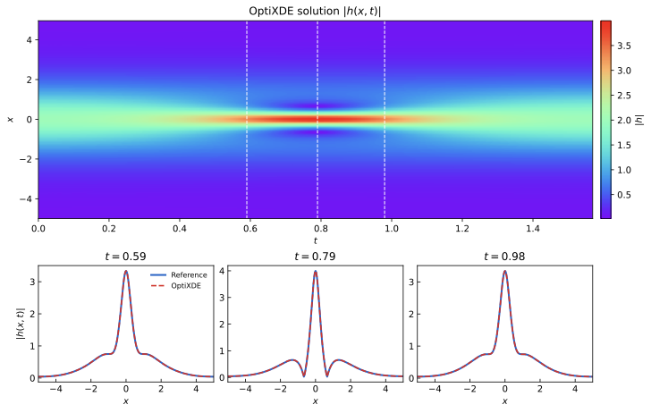
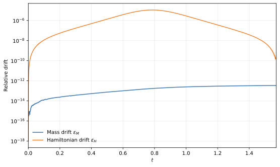

# Benchmarks

This page reports reproducible results generated by the current OptiXDE
examples. The emphasis is on accuracy, convergence behavior, physical
diagnostics, and difficult geometry. Values are taken from saved result files
or the convergence output of the linked benchmark scripts; no placeholder
timing or error data are used.

## Benchmark summary

| Problem | Discretization | Reference or diagnostic | Main observation |
|---|---|---|---|
| Poisson on an L-shaped domain | FFT-compatible embedding with smoothed penalization | Singular harmonic reference | Error is localized near the re-entrant corner and embedded interface |
| 1D viscous Burgers | FFT splitting with odd periodic extension | Cole--Hopf quadrature | Approximately second-order temporal convergence |
| 2D Allen--Cahn | Spectral diffusion and exact reaction, Strang splitting | Independent Fourier ETDRK4 | Second-order temporal convergence and monotone free-energy decay |
| 1D cubic Schrödinger | Split-step Fourier method | Fine-grid Fourier RK4 | Near second-order behavior before the spatial/reference error floor |

!!! note "Interpreting the tables"
    Rates are computed between successive timestep or grid refinements. A
    reduced rate at the finest level does not necessarily indicate instability:
    once temporal error is small, spatial discretization and reference-solution
    error can dominate.

## Poisson problem on an L-shaped domain

The physical domain is

\[
\Omega=(-1,1)^2\setminus([0,1]\times[-1,0]),
\]

with a re-entrant corner of angle \(3\pi/2\). The analytical reference is the
singular harmonic field

\[
u_{\mathrm{ex}}(r,\theta)
=r^{2/3}\sin(2\theta/3).
\]

The domain is embedded in a periodic Cartesian box. Dirichlet data are imposed
through a smoothed Brinkman-type penalty layer with
\(\eta=0.003h^2\) and
\(\varepsilon=\max(0.03,2.5h)\).

[Download the vector PDF](assets/figures/benchmarks/poisson_lshape_penalty_fields_n512.pdf)

### Global error

| Grid | \(e_{L^2}(\Omega)\) | Rate |
|---:|---:|---:|
| \(256^2\) | \(1.571034\times10^{-3}\) | -- |
| \(384^2\) | \(1.989538\times10^{-4}\) | 5.096 |
| \(512^2\) | \(3.145243\times10^{-5}\) | 6.412 |
| \(768^2\) | \(1.000724\times10^{-5}\) | 2.824 |

### Smooth-interior error

The interior metric excludes a neighborhood of the singular corner and a thin
embedded-boundary layer.

| Grid | \(e_{L^2}(\Omega_{\mathrm{in}})\) | Rate |
|---:|---:|---:|
| \(256^2\) | \(1.705635\times10^{-3}\) | -- |
| \(384^2\) | \(2.139415\times10^{-4}\) | 5.120 |
| \(512^2\) | \(2.867095\times10^{-5}\) | 6.986 |
| \(768^2\) | \(2.246577\times10^{-6}\) | 6.280 |

The global norm eventually reflects the corner singularity and finite penalty
layer, whereas the field away from both regions retains rapid, spectral-like
refinement behavior.

Script:
[`poisson_lshape_penalty_benchmark.py`](https://github.com/yangyLab/OptiXDE/blob/main/examples/benchmarks/poisson_lshape_penalty_benchmark.py)

## Viscous Burgers equation

The benchmark solves

\[
u_t+u\,u_x=\nu u_{xx},
\qquad
\nu=\frac{0.01}{\pi},
\]

on \([-1,1]\) with homogeneous Dirichlet data. The endpoint-inclusive physical
solution uses \(N_x=1024\), while an odd extension produces a 2048-point
periodic field for FFT propagation. The nonlinear conservative flux is
de-aliased with the two-thirds rule, and the reference solution is evaluated
from the Cole--Hopf representation using 8192 quadrature points.

[Download the solution PDF](assets/figures/benchmarks/burgers_solution.pdf)

| \(\Delta t\) | \(e_{L^2}(T)\) | \(e_\infty(T)\) | Rate |
|---:|---:|---:|---:|
| \(1.00\times10^{-3}\) | \(4.450652\times10^{-5}\) | \(2.836634\times10^{-4}\) | -- |
| \(5.00\times10^{-4}\) | \(1.123266\times10^{-5}\) | \(7.035812\times10^{-5}\) | 1.986 |
| \(2.50\times10^{-4}\) | \(2.821009\times10^{-6}\) | \(1.712867\times10^{-5}\) | 1.993 |
| \(1.25\times10^{-4}\) | \(7.135400\times10^{-7}\) | \(4.065077\times10^{-6}\) | 1.983 |

The measured rate is consistently close to two, matching the midpoint
nonlinear update within the symmetric diffusion splitting. The maximum boundary
residual is \(5.10\times10^{-14}\), and the kinetic-energy history is monotone
to reported precision.

[Download the diagnostics PDF](assets/figures/benchmarks/burgers_diagnostics.pdf)

Script:
[`burgers_1d_deepxde_benchmark.py`](https://github.com/yangyLab/OptiXDE/blob/main/examples/base/burgers_1d_deepxde_benchmark.py)

## Two-dimensional Allen--Cahn equation

The phase-field benchmark advances

\[
u_t=\varepsilon^2\Delta u+u-u^3,
\qquad
\varepsilon=0.04,
\]

on a \(256^2\) periodic grid to \(T=100\). Spectral diffusion is combined with
the exact pointwise reaction flow by Strang splitting. The independent
reference uses Fourier ETDRK4 on a \(512^2\) grid with
\(\Delta t_{\mathrm{ref}}=0.05\).

[Download the field-evolution PDF](assets/figures/benchmarks/allencahn_fields_contour.pdf)

| \(\Delta t\) | \(e_{L^2}(T)\) | Rate | \(\mathcal{E}(T)\) | \(R_h(T)\) |
|---:|---:|---:|---:|---:|
| \(2.0\times10^{-1}\) | \(2.452780\times10^{-4}\) | -- | 0.34722423 | 1.46550466 |
| \(1.0\times10^{-1}\) | \(6.167643\times10^{-5}\) | 1.992 | 0.34722108 | 1.46550606 |
| \(5.0\times10^{-2}\) | \(1.544310\times10^{-5}\) | 1.998 | 0.34722081 | 1.46550643 |
| \(2.5\times10^{-2}\) | \(3.862123\times10^{-6}\) | 1.999 | 0.34722078 | 1.46550653 |

The timestep study shows second-order convergence. The free energy decreases
from 0.37220609 to approximately 0.3472208 with no detected monotonicity
violation. The equivalent radius decreases from 1.57049 to 1.46551, making the
curvature-driven interface motion visible over the chosen time interval.

[Download the diagnostics PDF](assets/figures/benchmarks/allencahn_diagnostics.pdf)

Script:
[`allen_cahn_raissi_3_2_1_reproduction.py`](https://github.com/yangyLab/OptiXDE/blob/main/examples/base/allen_cahn_raissi_3_2_1_reproduction.py)

## Cubic Schrödinger equation

The one-dimensional focusing cubic nonlinear Schrödinger equation is solved
with a periodic split-step Fourier method. The benchmark uses \(N_x=256\);
the independent reference uses 2048 Fourier modes and
\(\Delta t_{\mathrm{ref}}=6.25\times10^{-6}\).

[Download the solution PDF](assets/figures/benchmarks/schrodinger_raissi_3_1_1.pdf)

| \(\Delta t\) | \(e_{\max}\) | Rate | Mass drift | Hamiltonian drift |
|---:|---:|---:|---:|---:|
| \(2.0\times10^{-3}\) | \(3.439933\times10^{-4}\) | -- | \(9.19\times10^{-14}\) | \(7.15\times10^{-8}\) |
| \(1.0\times10^{-3}\) | \(8.703352\times10^{-5}\) | 1.983 | \(6.62\times10^{-14}\) | \(2.92\times10^{-8}\) |
| \(5.0\times10^{-4}\) | \(2.710324\times10^{-5}\) | 1.683 | \(3.40\times10^{-13}\) | \(1.94\times10^{-10}\) |
| \(2.5\times10^{-4}\) | \(1.803587\times10^{-5}\) | 0.588 | \(8.37\times10^{-13}\) | \(4.99\times10^{-11}\) |

The two coarser steps exhibit the expected second-order splitting behavior. At
finer steps, the rate decreases as temporal error approaches the
spatial/reference floor. Mass remains conserved to approximately
\(10^{-12}\) or better, while the Hamiltonian drift decreases to
\(5.0\times10^{-11}\).

[Download the invariant-diagnostics PDF](assets/figures/benchmarks/schrodinger_invariants.pdf)

Script:
[`schrodinger_raissi_3_1_1_reproduction.py`](https://github.com/yangyLab/OptiXDE/blob/main/examples/base/schrodinger_raissi_3_1_1_reproduction.py)

## Reproducibility notes

- Tables report the values written by the corresponding scripts.
- PDF files are the original vector outputs; PNG files are web previews rendered
  from those PDFs.
- Errors should be compared only when the grid, time interval, reference
  solution, and norm definition agree.
- Performance numbers are intentionally omitted until runs record hardware,
  backend, precision, warm-up policy, and timing methodology. This avoids
  publishing machine-dependent placeholder values.
