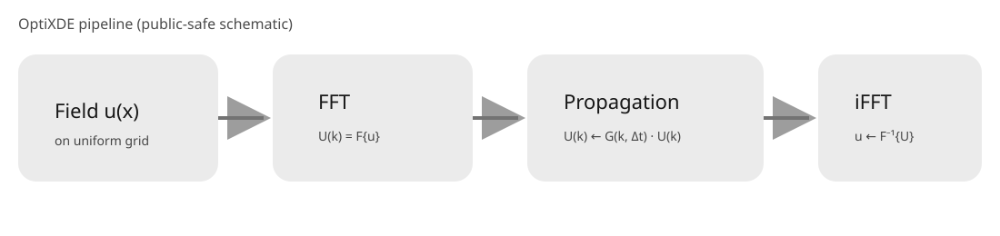

# Method

## 1. Core idea

OptiXDE treats a differential equation as an operator acting on a field sampled
on a uniform Cartesian grid. When the linear spatial operator is diagonal in a
Fourier, sine, or cosine basis, differentiation and time evolution reduce to
independent operations on spectral modes.

For

\[
\frac{\partial u}{\partial t}=\mathcal{L}u,
\]

let \(\lambda(\mathbf{k})\) be the spectral symbol of
\(\mathcal{L}\). A linear time step is

\[
\widehat{u}^{\,n+1}(\mathbf{k})
=
\underbrace{
\exp\!\left[\lambda(\mathbf{k})\Delta t\right]
}_{G(\mathbf{k},\Delta t)}
\widehat{u}^{\,n}(\mathbf{k}),
\]

or, in physical space,

\[
u^{n+1}
=
\mathcal{F}^{-1}
\left[
G(\mathbf{k},\Delta t)\,
\mathcal{F}[u^n]
\right].
\]

This transform--propagate--inverse-transform loop is the main computational
pattern in OptiXDE. It replaces stiffness-matrix assembly with FFTs and
pointwise spectral multiplication for the rectangular spectral solvers.

{ width="900" }

!!! note "Role of OptiXDE"
    Fourier propagation itself is classical. OptiXDE combines it with reusable
    backends, cached operators, boundary transforms, nonlinear splitting,
    geometry tools, diagnostics, and post-processing in one consistent solver
    interface.

## 2. Discrete spectral grid

For a periodic rectangle
\(\widetilde{\Omega}=[0,L_x)\times[0,L_y)\), the field is stored with shape
`(Ny, Nx)` on

\[
x_j=\frac{jL_x}{N_x},
\qquad
y_\ell=\frac{\ell L_y}{N_y}.
\]

The FFT-ordered angular wave numbers are

\[
k_x=2\pi\,\mathrm{fftfreq}(N_x,L_x/N_x),
\qquad
k_y=2\pi\,\mathrm{fftfreq}(N_y,L_y/N_y),
\]

and OptiXDE caches the two-dimensional grids and

\[
K^2=k_x^2+k_y^2.
\]

The first array axis is \(y\), and the second is \(x\). NumPy, CuPy, and
PyTorch backends use the same layout. Cache keys include grid size, domain
length, dtype, and device, preventing incompatible frequency grids or
propagators from being reused.

## 3. Linear propagation and inversion

The diffusion equation illustrates the basic construction:

\[
\frac{\partial u}{\partial t}=D\Delta u.
\]

Fourier transformation gives

\[
\frac{\partial\widehat u}{\partial t}
=
-DK^2\widehat u,
\]

so each mode can be integrated analytically:

\[
\widehat u^{\,n+1}
=
\exp(-DK^2\Delta t)\widehat u^{\,n}.
\]

Because the multiplier has magnitude no greater than one for
\(D,\Delta t\ge0\), the constant-coefficient linear diffusion step is
non-expansive and has no explicit diffusion stability limit.

Other linear equations use the same structure with a different diagonal
operator:

| Equation | Spectral treatment |
|---|---|
| Diffusion \(u_t=D\Delta u\) | \(\exp(-DK^2\Delta t)\) |
| Poisson \(-\Delta u=f\) | \(\widehat u=\widehat f/K^2\), with the zero mode fixed |
| Shifted Helmholtz \((-\Delta+k_0^2)u=f\) | \(\widehat u=\widehat f/(K^2+k_0^2)\) |
| Wave \(u_{tt}=c^2\Delta u\) | exact modal oscillator update for displacement and velocity |
| Free Schrödinger \(\psi_t=ia\Delta\psi\) | \(\exp(-iaK^2\Delta t)\) |

For periodic Poisson and Neumann Poisson problems, the Laplacian has a constant
nullspace. OptiXDE can subtract the mean of \(f\) to enforce compatibility and
sets the solution zero mode to fix the additive gauge.

For periodic diffusion with a source, OptiXDE provides an ETD1 update using

\[
\varphi_1(z)=\frac{\exp(z)-1}{z},
\qquad
\varphi_1(0)=1,
\]

with a stable small-\(z\) approximation. The source is sampled at the midpoint
of the step.

## 4. Nonlinear equations and splitting

For

\[
u_t=\mathcal{L}u+\mathcal{N}(u),
\]

OptiXDE propagates the constant-coefficient linear part in spectral space and
evaluates nonlinear products in physical space. This pseudo-spectral approach
avoids forming convolution sums explicitly:

\[
u=\mathcal{F}^{-1}[\widehat u],
\qquad
\widehat{\mathcal{N}}
=
\mathcal{F}[\mathcal{N}(u)].
\]

The library provides first-order Lie splitting and symmetric second-order
Strang splitting:

\[
\text{Lie:}\quad
\Phi_N(\Delta t)\Phi_L(\Delta t),
\]

\[
\text{Strang:}\quad
\Phi_L(\Delta t/2)
\Phi_N(\Delta t)
\Phi_L(\Delta t/2).
\]

Representative implementations are:

| Solver | Linear part | Physical-space or nonlinear part |
|---|---|---|
| Allen--Cahn | spectral diffusion | exact pointwise reaction \(u-u^3\) |
| Periodic Burgers | exact Fourier diffusion half-steps | conservative convection with Euler or midpoint RK2 |
| Cubic Schrödinger | Fourier dispersion half-steps | exact local nonlinear phase |
| Periodic Navier--Stokes | Fourier viscosity and Poisson inversion | conservative vorticity flux with Euler or midpoint RK2 |

Quadratic nonlinearities can use the two-thirds de-aliasing rule. This removes
unresolved high-frequency content produced by physical-space multiplication.

!!! warning "Linear stability is not complete stability"
    An exact linear propagator does not remove timestep restrictions introduced
    by explicit nonlinear terms, operator splitting, embedded-boundary updates,
    or finite-difference substeps. Nonlinear calculations still require
    timestep and resolution studies.

## 5. Boundary conditions on rectangles

For coordinate-aligned rectangular domains, OptiXDE selects a transform whose
basis satisfies the homogeneous boundary condition:

| Boundary condition | Numerical treatment |
|---|---|
| Periodic | FFT on an endpoint-excluded grid |
| Homogeneous Dirichlet | DST on the interior of a full endpoint-inclusive grid |
| Homogeneous Neumann | DCT on a full endpoint-inclusive grid |
| Robin | spectral prediction or preconditioning plus local boundary projection |

The DST path returns zero boundary values. The DCT path includes the constant
mode and therefore exposes the Poisson compatibility and gauge controls.

Nonhomogeneous Dirichlet Poisson data can be treated by a lifting

\[
u=v+T_b,
\qquad
v|_{\partial\Omega}=0,
\]

where a Coons patch \(T_b\) matches the four boundary curves and the homogeneous
correction \(v\) is solved with the DST kernel.

For rectangular Robin data,

\[
\alpha u+\beta\partial_nu=g,
\]

the current implementation uses one-sided finite-difference projection on each
side. Poisson combines this projection with a preconditioned iteration;
diffusion applies a spectral prediction followed by local boundary
projections. Homogeneous Dirichlet or Neumann limits are routed to DST or DCT
when possible.

## 6. Geometry and embedded domains

### Signed-distance convention

The geometry package uses the **positive-inside** convention:

\[
d(\mathbf{x})>0\ \text{inside }\Omega,\qquad
d(\mathbf{x})=0\ \text{on }\partial\Omega,\qquad
d(\mathbf{x})<0\ \text{outside }\Omega.
\]

Accordingly,

\[
d_{A\cup B}=\max(d_A,d_B),\qquad
d_{A\cap B}=\min(d_A,d_B),\qquad
d_{A\setminus B}=\min(d_A,-d_B).
\]

Rectangle, disk, sphere, and polygon primitives can therefore be combined
without a body-fitted mesh.

### Masks and boundary bands

The hard interior mask is

\[
m_\Omega^0=\mathbf{1}_{d\ge0}.
\]

A smooth mask and boundary weight are also available:

\[
m_\Omega
=
\frac12
\left[
1+\tanh\!\left(\frac{d}{\varepsilon}\right)
\right],
\]

\[
w_\Gamma
=
\frac{1}{2\varepsilon}
\operatorname{sech}^2\!\left(\frac{d}{\varepsilon}\right).
\]

The smoothing thickness \(\varepsilon\) is expressed in physical units and is
typically chosen on the order of one to three grid spacings. Smoothing reduces
Gibbs-type oscillation from a discontinuous mask, but introduces a finite
interface layer that must be considered in refinement studies.

### Current embedded-domain paths

The general operator-level form is

\[
u^{n+1}
=
\mathcal{E}_{\Omega,\Gamma}
\left(
\mathcal{T}_G[u^n]
\right),
\]

where \(\mathcal{T}_G\) is a propagation step and
\(\mathcal{E}_{\Omega,\Gamma}\) applies geometry or boundary constraints in
physical space.

The current library exposes two practical routes:

1. hard masks, smooth masks, and boundary weights for penalty-style spectral
   workflows and custom solvers;
2. segmented polygon solvers that rasterize Dirichlet, Neumann, and Robin data
   on Cartesian grids.

The segmented steady Poisson solver assembles a sparse masked-grid system.
Transient polygon diffusion and wave utilities use explicit masked finite
differences. These solvers share OptiXDE's geometry and boundary abstractions,
but their current numerical kernel is not a pure FFT propagator.

## 7. Implementation and complexity

For a periodic linear problem, preprocessing constructs the grid and retrieves
or creates the frequency arrays and propagation multiplier. Each subsequent
step performs:

```text
forward transform
→ pointwise spectral propagation
→ inverse transform
→ optional nonlinear, boundary, geometry, or diagnostic operations
```

Static arrays remain on the selected device. Backend caches reuse frequency
grids, while `PropagatorCache` reuses exponential and inverse-\(K^2\)
multipliers.

For \(N\) grid points, an FFT-based propagation step requires

\[
\mathcal{O}(N\log N)
\]

work and

\[
\mathcal{O}(N)
\]

memory. Pointwise propagation, nonlinear products, masks, and local boundary
corrections are \(\mathcal{O}(N)\) and naturally parallel.

This complexity applies to the rectangular FFT solvers. The segmented Poisson
solver additionally solves a sparse system, and the inlet/outlet cylinder-flow
solver uses a cached sparse pressure factorization.

## 8. Accuracy and scope

Smooth periodic problems can exhibit spectral spatial convergence. In practice,
accuracy may instead be limited by nonsmooth data, geometric corners,
unresolved nonlinear scales, mask thickness, boundary projection, or
floating-point precision.

The spectral core is best suited to uniform Cartesian grids and
constant-coefficient operators diagonalizable by FFT, DST, or DCT. Variable
coefficients and irregular interfaces require splitting, correction, or an
alternative discretization. OptiXDE exposes these paths explicitly rather than
presenting them as one universally exact propagator.

For function signatures, backend options, and return contracts, see the
[API reference](api/index.md).
