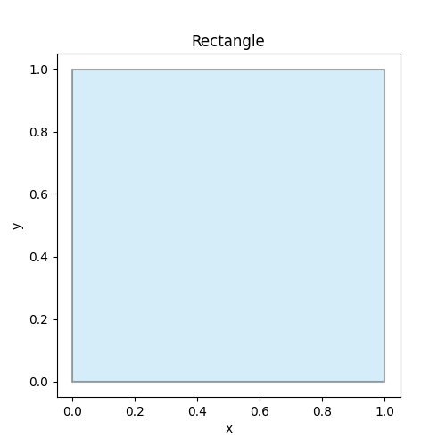
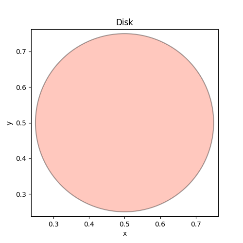
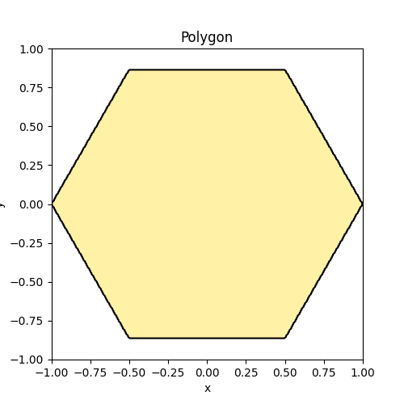
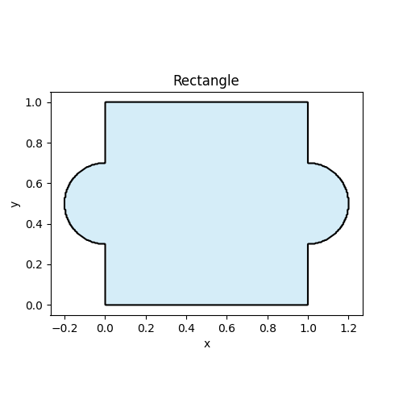

# Quickstart

This public site can show **how to use OptiXDE** without exposing the private repository.

## Installation

If OptiXDE is private, keep installation instructions generic:

```bash
# Option A: internal/private install (example)
pip install optixde --extra-index-url <YOUR_PRIVATE_INDEX>

# Option B: request access to the private repo
# (See the "Cite & Contact" page)
```
## Geometry Construction Tutorial

OptiXDE runs on an FFT-compatible uniform grid, so geometry is represented **implicitly** as a *mask field* on that grid (not a mesh). The recommended public-facing pipeline is:

**primitives → CSG → binary mask → smoothed mask → embedded/penalized PDE**

This keeps the API simple while allowing complex shapes, and it’s safe to share publicly because it demonstrates **usage** rather than implementation.

---

### 1) Create a geometry (primitives)
OptiXDE provides simple 2D primitives that can be composed later with CSG operations.
Here are three basic examples.

#### Example 1: Rectangle
```python
from optixde.geometry.primitives import Rectangle
from optixde.post.plotting import show_geometry

geo = Rectangle(0.0, 1.0, 0.0, 1.0)
show_geometry(geo, title="Rectangle", facecolor="skyblue", edgecolor="black")
```


#### Example 2: Disk
```python
from optixde.geometry.primitives import Disk
from optixde.post.plotting import show_geometry

geo = Disk((0.5, 0.5), 0.25)
show_geometry(geo, title="Disk", facecolor="tomato", edgecolor="black")
```


#### Example 3: Polygon
```python
from optixde.geometry.primitives import Polygon
from optixde.post.plotting import show_geometry

geo = Polygon([
    (1.0, 0.0),
    (0.5, 0.8660254),
    (-0.5, 0.8660254),
    (-1.0, 0.0),
    (-0.5, -0.8660254),
    (0.5, -0.8660254),
])
show_geometry(geo, title="Polygon", facecolor="gold", edgecolor="black")
```


### 2) Boolean (primitives)
Boolean operations combine simple primitives into more complex shapes. In OptiXDE, the most common operations are:

-  : union
-  : intersection
-  : difference

Below are three minimal examples using `Rectangle`, `Disk`, and `Polygon`.

---

#### Example 1: Union

```python
from optixde.geometry.primitives import Rectangle, Disk
from optixde.post.plotting import show_geometry
from optixde.geometry.boolean import Union

rect = Rectangle(0.0, 1.0, 0.0, 1.0)
left_circle  = Disk((0.0, 0.5), 0.2)
right_circle = Disk((1.0, 0.5), 0.2)
geo = Union(rect, left_circle, right_circle)
show_geometry(geo, title="Rectangle", facecolor="skyblue", edgecolor="black")
```

