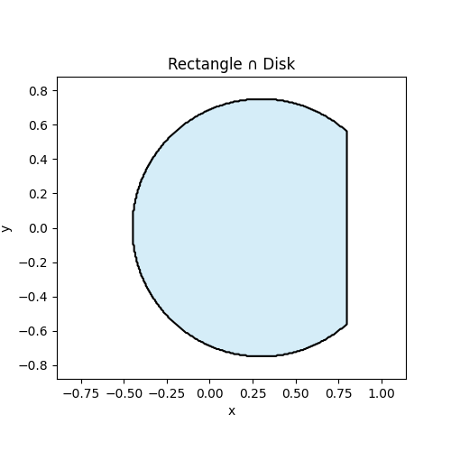
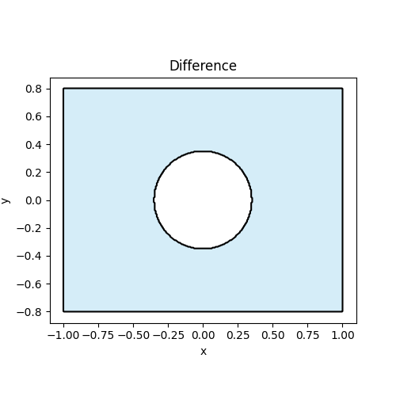
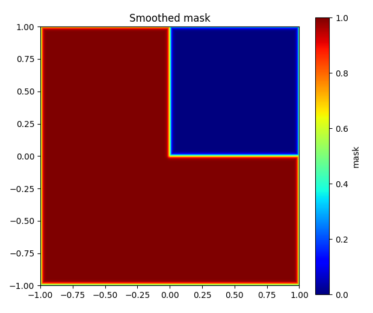
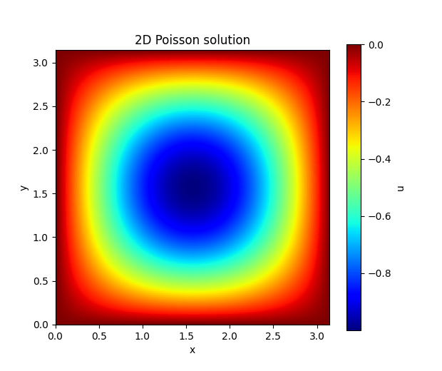
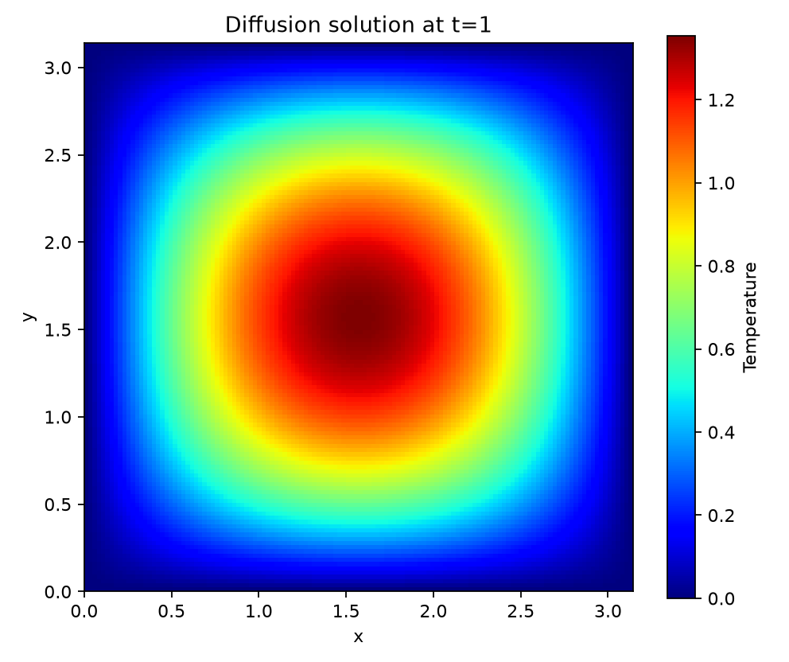
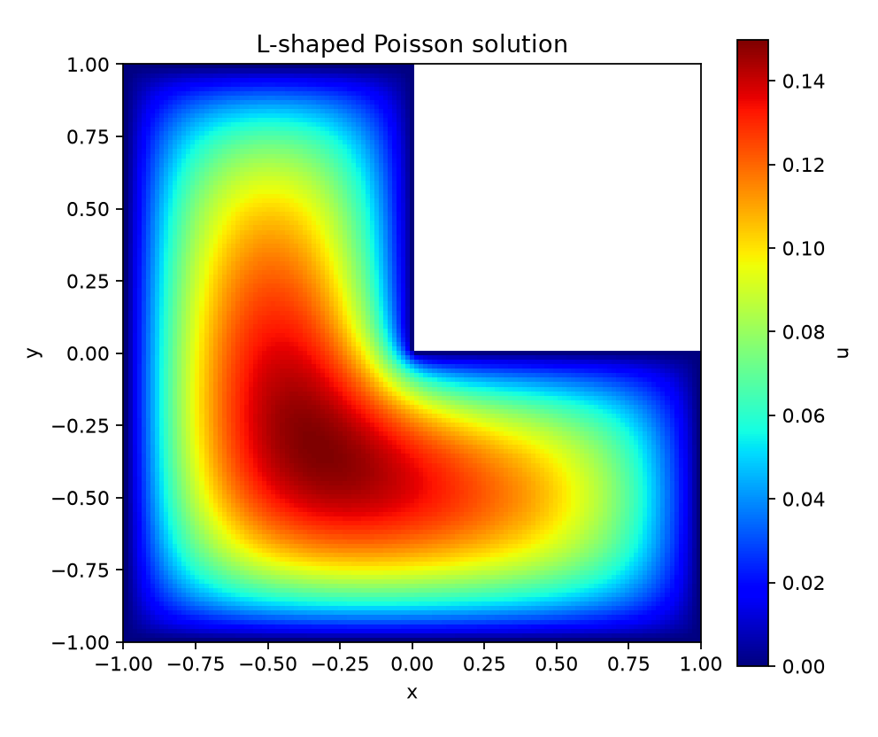

# Quickstart

This public site can show **how to use OptiXDE** without exposing the private repository.

## Installation

If OptiXDE is private, keep installation instructions generic:

```bash
# Option A: internal/private install (example)
pip install optixde --extra-index-url <YOUR_PRIVATE_INDEX>

# Option B: request access to the private repo
# (See the "Cite & Contact" page)
```

### Install the public release

Public releases of OptiXDE can be installed directly from PyPI. The core
package only requires NumPy; install optional features when they are needed.

```bash
pip install optixde

# Optional features
pip install "optixde[plot]"    # Matplotlib plotting helpers
pip install "optixde[sparse]"  # SciPy-based embedded-domain solvers
pip install "optixde[gpu]"     # PyTorch backend for GPU FFT solvers
```

Verify the installation by printing the installed version:

```python
import optixde

print(optixde.__version__)
```

## Geometry Construction Tutorial

OptiXDE runs on an FFT-compatible uniform grid, so geometry is represented **implicitly** as a *mask field* on that grid (not a mesh). The recommended public-facing pipeline is:

**primitives → CSG → binary mask → smoothed mask → embedded/penalized PDE**

This keeps the API simple while allowing complex shapes, and it’s safe to share publicly because it demonstrates **usage** rather than implementation.

---

### 1) Create a geometry (primitives)
OptiXDE provides simple 2D primitives that can be composed later with CSG operations.
Here are three basic examples.

#### Example 1: Rectangle
```python
from optixde.geometry.primitives import Rectangle
from optixde.post.plotting import show_geometry

geo = Rectangle(0.0, 1.0, 0.0, 1.0)
show_geometry(geo, title="Rectangle", facecolor="skyblue", edgecolor="black")
```


#### Example 2: Disk
```python
from optixde.geometry.primitives import Disk
from optixde.post.plotting import show_geometry

geo = Disk((0.5, 0.5), 0.25)
show_geometry(geo, title="Disk", facecolor="tomato", edgecolor="black")
```


#### Example 3: Polygon
```python
from optixde.geometry.primitives import Polygon
from optixde.post.plotting import show_geometry

geo = Polygon([
    (1.0, 0.0),
    (0.5, 0.8660254),
    (-0.5, 0.8660254),
    (-1.0, 0.0),
    (-0.5, -0.8660254),
    (0.5, -0.8660254),
])
show_geometry(geo, title="Polygon", facecolor="gold", edgecolor="black")
```


### 2) Apply boolean operations
Boolean operations combine simple primitives into more complex shapes. In OptiXDE, the most common operations are:

-  : union
-  : intersection
-  : difference

Below are three minimal examples using `Rectangle`, `Disk`, and `Polygon`.

---

#### Example 1: Union of a rectangle and two circle

```python
from optixde.geometry.primitives import Rectangle, Disk
from optixde.post.plotting import show_geometry
from optixde.geometry.boolean import Union

rect = Rectangle(0.0, 1.0, 0.0, 1.0)
left_circle  = Disk((0.0, 0.5), 0.2)
right_circle = Disk((1.0, 0.5), 0.2)
geo = Union(rect, left_circle, right_circle)
show_geometry(geo, title="Rectangle", facecolor="skyblue", edgecolor="black")
```


#### Example: Intersection of a rectangle and a disk

```python
from optixde.geometry.primitives import Rectangle, Disk
from optixde.geometry.boolean import Intersection
from optixde.post.plotting import show_geometry

rect = Rectangle(-0.8, 0.8, -0.8, 0.8)
disk = Disk((0.3, 0.0), 0.75)

geo = Intersection(rect, disk)

show_geometry(
    geo,
    title="Rectangle ∩ Disk",
    facecolor="skyblue",
    edgecolor="black",
)
```


#### Example: Difference of a rectangle and a disk

```python
from optixde.geometry.primitives import Rectangle, Disk
from optixde.geometry.boolean import Difference
from optixde.post.plotting import show_geometry

rect = Rectangle(-1.0, 1.0, -0.8, 0.8)
hole = Disk((0.0, 0.0), 0.35)

geo = Difference(rect, hole)

show_geometry(
    geo,
    title="Difference",
    facecolor="skyblue",
    edgecolor="black",
)
```


### 3) From geometry to mask field

OptiXDE represents geometry on an FFT-compatible uniform grid as a mask field.

#### Example: geometry to binary mask
The geometry can be sampled on a uniform Cartesian grid and represented as a mask field.  
In this example, an L-shaped domain is created by subtracting the square `[0,1] × [0,1]` from the outer square `[-1,1] × [-1,1]`. The geometry is evaluated on a regular grid, and a smoothed mask is generated for visualization and for later use in embedded-domain solving.
```python
import numpy as np
import matplotlib.pyplot as plt

from optixde.geometry.primitives import Rectangle
from optixde.geometry.boolean import Difference

x = np.linspace(-1.0, 1.0, 257)
y = np.linspace(-1.0, 1.0, 257)
X, Y = np.meshgrid(x, y, indexing="xy")
P = np.c_[X.ravel(), Y.ravel()]

geo = Difference(
    Rectangle(-1.0, 1.0, -1.0, 1.0),
    Rectangle(0.0, 1.0, 0.0, 1.0),
)

eps = 2.0 * (x[1] - x[0])
mask = geo.smooth_mask(P, eps=eps).reshape(len(y), len(x))

plt.figure(figsize=(6.2, 5.2))
plt.imshow(
    mask,
    origin="lower",
    cmap="jet",
    extent=[x[0], x[-1], y[0], y[-1]],
)
plt.colorbar(label="mask")
plt.title("Smoothed mask")
plt.tight_layout()
plt.show()
```


### 4) Define, solve, and visualize a PDE

Once the computational grid and source term are prepared, solving a PDE in OptiXDE is straightforward.

In this example, we consider the 2D Poisson equation on the square domain `[0, \pi] \times [0, \pi]` with homogeneous Dirichlet boundary conditions,
\[
-\Delta u = f \quad \text{in } \Omega,
\]
where the right-hand side is chosen as
\[
f(x,y)=2\sin(x)\sin(y).
\]
For this choice, the exact solution is
\[
u(x,y)=\sin(x)\sin(y),
\]
which makes the example convenient for verification. After defining the source field on the uniform grid, the Poisson solver is called directly, and the resulting solution is visualized as a color map. This illustrates the basic OptiXDE workflow: define the PDE, solve it on the FFT-compatible grid, and inspect the result immediately.

```python
import numpy as np
import matplotlib.pyplot as plt
from optixde.solvers.base.poisson import poisson2d_solve

Lx = Ly = np.pi
N = 128

dx = Lx / (N + 1)
dy = Ly / (N + 1)
x = np.linspace(dx, Lx - dx, N)
y = np.linspace(dy, Ly - dy, N)
X, Y = np.meshgrid(x, y, indexing="xy")

f = np.zeros((N + 2, N + 2))
f[1:-1, 1:-1] = 2.0 * np.sin(X) * np.sin(Y)

u = poisson2d_solve(f, Lx, Ly, bc="dirichlet", workers=8)

plt.figure(figsize=(6.2, 5.2))
plt.imshow(
    u,
    cmap="jet",
    origin="lower",
    extent=[0, Lx, 0, Ly],
)
plt.colorbar(label="u")
plt.title("2D Poisson solution")
plt.xlabel("x")
plt.ylabel("y")
plt.show()
```


### 5) Understand grid and boundary-condition conventions

Two-dimensional fields in OptiXDE use shape `(Ny, Nx)`: the first axis is the
`y` direction and the second axis is the `x` direction. The grid construction
depends on the boundary condition because each condition uses a different
spectral transform.

| Boundary condition | Transform or enforcement | Recommended grid |
| --- | --- | --- |
| `periodic` | FFT | Endpoint excluded |
| `dirichlet` | DST on the interior | Physical boundary included |
| `neumann` | DCT on the full field | Physical boundary included |
| `robin` | Boundary projection / penalty | Physical boundary included |

For a periodic domain `[0,Lx) × [0,Ly)`, construct an endpoint-free grid:

```python
x = np.linspace(0.0, Lx, Nx, endpoint=False)
y = np.linspace(0.0, Ly, Ny, endpoint=False)
X, Y = np.meshgrid(x, y, indexing="xy")
```

For homogeneous Dirichlet conditions, include the physical boundary. The
interior values are stored in `u[1:-1, 1:-1]`, while the returned boundary is
zero.

```python
x = np.linspace(0.0, Lx, Nx + 2)
y = np.linspace(0.0, Ly, Ny + 2)
X, Y = np.meshgrid(x, y, indexing="xy")
u = np.zeros((Ny + 2, Nx + 2))
```

For periodic and Neumann Poisson problems, the source must have zero mean.
OptiXDE fixes the additive constant of the solution with a zero-mean gauge.

### 6) Solve a time-dependent PDE

OptiXDE can also advance time-dependent equations. Consider the two-dimensional
diffusion equation

\[
\frac{\partial u}{\partial t}=D\Delta u,
\]

with homogeneous Dirichlet boundary conditions. Each call to
`diffusion2d_solve` advances the field by one timestep.

```python
import numpy as np
import matplotlib.pyplot as plt
from optixde.solvers import diffusion2d_solve

Lx = Ly = np.pi
N = 128
D = 1.0
dt = 0.05
T = 1.0

dx = Lx / (N + 1)
x = np.linspace(dx, Lx - dx, N)
y = np.linspace(dx, Ly - dx, N)
X, Y = np.meshgrid(x, y, indexing="xy")

u = np.zeros((N + 2, N + 2))
u[1:-1, 1:-1] = 10.0 * np.sin(X) * np.sin(Y)

for _ in range(int(round(T / dt))):
    u = diffusion2d_solve(u, D, Lx, Ly, dt, bc="dirichlet")

plt.figure(figsize=(6.2, 5.2))
plt.imshow(u, cmap="jet", origin="lower", extent=[0, Lx, 0, Ly])
plt.colorbar(label="Temperature")
plt.title(f"Diffusion solution at t={T:g}")
plt.xlabel("x")
plt.ylabel("y")
plt.tight_layout()
plt.show()
```



### 7) Solve a PDE on an embedded geometry

The geometry-to-mask workflow can be continued directly into an embedded-domain
solve. Here the same L-shaped region is written as a polygon, homogeneous
Dirichlet data are assigned to every edge, and

\[
-\Delta u=1 \quad \text{in } \Omega,
\qquad
u=0 \quad \text{on } \partial\Omega
\]

is solved on a Cartesian grid. Install the `sparse` optional dependency before
running this example.

```python
import numpy as np
import matplotlib.pyplot as plt

from optixde.bc.segmented import DirichletBC, EdgeSegment
from optixde.geometry.primitives import Polygon
from optixde.solvers import poisson2d_polygonal_embedded

vertices = np.asarray([
    (0.0, 0.0),
    (1.0, 0.0),
    (1.0, -1.0),
    (-1.0, -1.0),
    (-1.0, 1.0),
    (0.0, 1.0),
])

geo = Polygon(vertices)
bcs = [
    DirichletBC(segment=EdgeSegment(edge_id=i), value=0.0)
    for i in range(len(vertices))
]

u, metadata = poisson2d_polygonal_embedded(
    geometry=geo,
    bcs=bcs,
    source=1.0,
    Nx=129,
    Ny=129,
    return_metadata=True,
)

grid = metadata["grid"]
cmap = plt.cm.jet.copy()
cmap.set_bad("white")

plt.figure(figsize=(6.2, 5.2))
plt.imshow(
    u,
    origin="lower",
    cmap=cmap,
    extent=[grid["x"][0], grid["x"][-1], grid["y"][0], grid["y"][-1]],
)
plt.colorbar(label="u")
plt.title("L-shaped Poisson solution")
plt.xlabel("x")
plt.ylabel("y")
plt.tight_layout()
plt.show()
```



### 8) Switch between CPU and GPU backends

NumPy is the default backend. Periodic FFT solvers can use the PyTorch backend
on a CPU or CUDA GPU without changing the equation. The following example uses
a manufactured periodic Poisson problem with the exact solution
`sin(2x) cos(3y)`.

```python
import numpy as np
from optixde.solvers import poisson2d_solve

Lx = Ly = 2.0 * np.pi
N = 128
x = np.linspace(0.0, Lx, N, endpoint=False)
y = np.linspace(0.0, Ly, N, endpoint=False)
X, Y = np.meshgrid(x, y, indexing="xy")
f = 13.0 * np.sin(2.0 * X) * np.cos(3.0 * Y)

u_cpu = poisson2d_solve(
    f, Lx, Ly,
    bc="periodic",
    backend_name="numpy",
)

u_gpu = poisson2d_solve(
    f, Lx, Ly,
    bc="periodic",
    backend_name="torch",
    device="cuda",
)
```

Use `device="cpu"` to test the PyTorch path on a machine without CUDA. The
Dirichlet and Neumann DCT/DST paths are primarily intended for NumPy arrays.

### 9) Inspect solver diagnostics

Unified solver entry points support `return_info=True`. The returned metadata
records which numerical path was used and is useful for tests, benchmarks, and
GPU checks.

```python
u, info = poisson2d_solve(
    f,
    Lx,
    Ly,
    bc="periodic",
    backend_name="numpy",
    return_info=True,
)

for key in (
    "solver",
    "equation",
    "bc",
    "transform",
    "backend",
    "device",
    "input_shape",
    "output_shape",
):
    print(f"{key}: {info[key]}")
```

Typical transform values include `fft`, `dst`, `dct`, and `robin_penalty`.
Equation-specific metadata may also report the timestep, diffusivity, wave
speed, viscosity, or other solver parameters.

### 10) Explore more equations

The same public solver namespace provides elliptic, evolution, nonlinear, wave,
and flow equations.

| Equation or topic | Main public entry points | Guide |
| --- | --- | --- |
| Poisson and Helmholtz | `poisson2d_solve`, `helmholtz2d_solve` | [Elliptic solvers](api/elliptic.md) |
| Diffusion and wave | `diffusion2d_solve`, `wave2d_solve` | [Evolution equations](api/evolution.md) |
| Allen--Cahn and Burgers | `allen_cahn2d_solve`, `burgers1d_solve` | [Evolution equations](api/evolution.md) |
| Navier--Stokes and cylinder flow | `navier_stokes2d_vorticity_solve`, `cylinder_flow2d_solve` | [Flow solvers](api/flows.md) |
| Schrödinger equations | `schrodinger2d_solve`, `schrodinger1d_cubic_solve` | [Evolution equations](api/evolution.md) |
| Polygonal domains | `poisson2d_polygonal_embedded`, `transient_diffusion_polygonal_embedded` | [Embedded domains](api/embedded.md) |

### 11) Run complete examples

The OptiXDE repository contains complete examples, validation cases, and paper
reproduction scripts. After cloning the repository and installing the desired
optional dependencies, try these commands:

```bash
git clone https://github.com/yangyLab/OptiXDE.git
cd OptiXDE
pip install -e ".[plot,sparse]"

# Minimal time-dependent diffusion example
python examples/base/diffusion_dirichlet_minimal_demo.py

# Embedded L-shaped Poisson example
python examples/base/poisson_lshape_deepxde_benchmark.py \
  --n 129 \
  --output examples/artifacts/lshape_quickstart.png

# PyTorch backend smoke test; use --device cuda on a CUDA runtime
python examples/benchmarks/colab_torch_gpu_smoke.py --device cpu --n 64
```

Examples do not save figures by default unless an output path is supplied.
Use `--output` or `--output-dir` to keep generated figures, CSV files, and
tables. See the [Benchmarks](benchmarks.md) page for larger verification and
performance studies.
